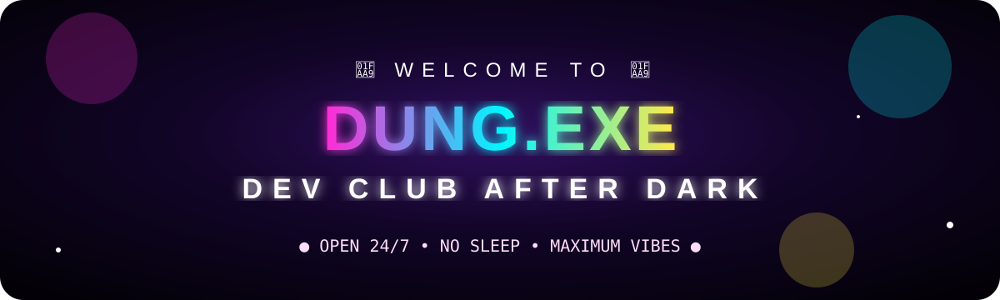
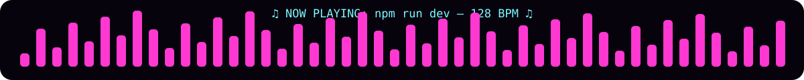
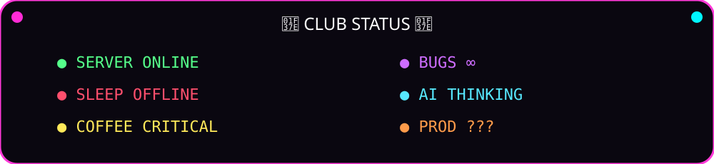
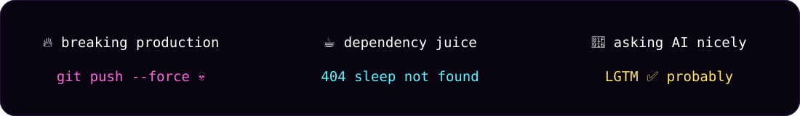

<div align="center">





### 🪩 WELCOME TO THE WORST/BEST DEV CLUB ON GITHUB 🪩




</div>

---

## 🍸 DEV BAR

```txt
SERVER      🟢 ONLINE
SLEEP       🔴 OFFLINE
COFFEE      🟡 CRITICAL
BUGS        🟣 INFINITE
PRODUCTION  🔥 PROBABLY FINE
DJ          🎧 localhost:3000
```

<div align="center">
  
</div>

---

## 🎛️ DJ BOOTH

```bash
$ npm run dev
> club started on http://localhost:3000

$ npm run build
> vibes compiled successfully

$ npm run deploy
> are you sure? y
> deploying on friday...
> 💀
```

<div align="center">
  
</div>

---

## 🐍 CONTRIBUTION SNAKE

<div align="center">
  
</div>

---

## 🎰 GITHUB ARCADE

<div align="center">


<br/>


</div>

---

## 🚨 CLUB RULES

- 🪩 No boring README sections.
- ☕ Caffeine is a dependency.
- 🐛 Every bug deserves a dance break.
- 🔥 Production incidents = free drinks.
- 🚫 No Friday deploys. Unless it would be funny.
- 🤖 AI is allowed in the DJ booth.
- 💀 `works on my machine` is legally binding.

<div align="center">
  
</div>
