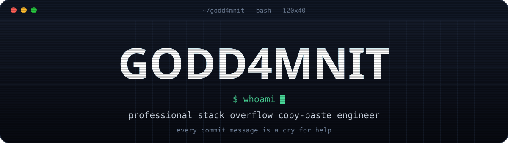
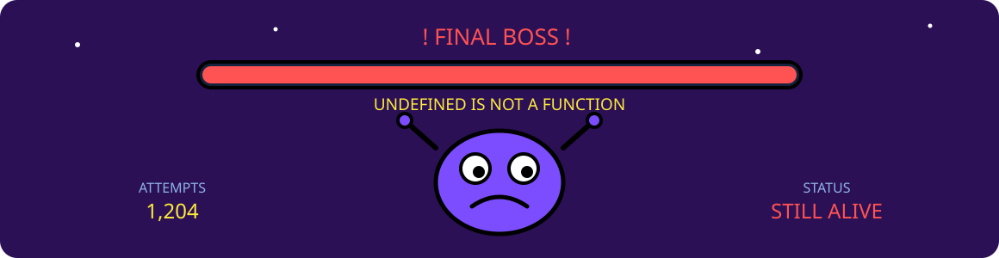
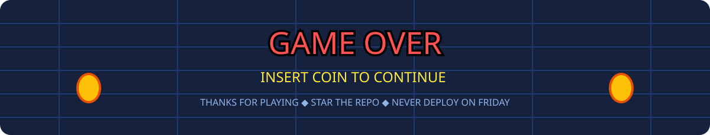

<div align="center">




</div>

## 🎮 PLAYER 1 — SELECT

```js
const player = {
  class:       "Backend",
  weapon:      "Ctrl+C, Ctrl+V",
  armor:       "it worked yesterday",
  passive:     "summons bugs when confident",
  weakness:    ["CSS", "timezones", "regex", "naming things"],
  ultimate:    "rm -rf node_modules && npm install",
  catchphrase: "works on my machine",
}
```

<br/>

## 📊 PLAYER STATS

<div align="center">
  
</div>

<br/>

## 😂 MEME WALL

<div align="center">
  
</div>

<br/>

## 👾 FINAL BOSS

<div align="center">
  
</div>

<br/>

## 🕹️ CHEAT CODES

```txt
↑ ↑ ↓ ↓ ← → ← → B A     →  all tests pass (do not ask how)
git push --force          →  invincibility. single use. ends friendships.
rm -rf node_modules       →  full heal. costs 4 minutes and 1.2 GB.
console.log("here")       →  reveals map
console.log("here2")      →  reveals map again, you still do not know
--force --no-verify       →  disables all safety. speedrun mode.
LGTM 🚀                    →  skip cutscene
```

<br/>

## 🗿 CHOOSE YOUR PATH

<div align="center">

| 🙅 **PRESS B** | 🙆 **PRESS A** |
|:---|:---|
| Writing unit tests | `console.log("here")` |
| Reading the official docs | A 2014 Stack Overflow answer, 3 upvotes |
| `git merge` and resolving conflicts | `git push --force` and a short prayer |
| Descriptive commit messages | `fix` |
| Refactoring the legacy module | `// TODO: refactor` (added 2019, still there) |
| Asking a senior dev | Asking an AI, then blaming the AI |

</div>

<br/>

## 📂 SECRET ROOMS — enter at your own risk

<details>
<summary><b>🔍 BOSS STRATEGY: how I debug</b></summary>

```js
console.log("1")
console.log("2")
console.log("HERE")
console.log("WHY")
console.log("WHYYYY")
console.log("😭")
// bug fixed. no idea which line did it. removing none of them.
```

</details>

<details>
<summary><b>🧪 QUEST LOG: my testing strategy</b></summary>

1. Open the app.
2. Click around a bit.
3. Looks fine.
4. Ship it.
5. Get paged at 2am.
6. Return to step 1 with significantly more emotion.

</details>

<details>
<summary><b>🤝 CO-OP MODE: how to work with me</b></summary>

- Do **not** ask why it works.
- Do **not** ask why it stopped working.
- Touch the config file and you own it now. That is the law.
- "It's a quick fix" is a threat, not an estimate.
- I will approve your PR in 4 seconds. I did not read it. LGTM 🚀

</details>

<details>
<summary><b>💼 TRUE ENDING: skills I actually have</b></summary>

<br/>

Jokes aside — the real stack:

`TypeScript` · `Node.js` · `NestJS` · `React` · `PostgreSQL` · `Redis` · `Docker` · `AWS` · `REST & WebSocket APIs`

Genuinely into backend architecture, developer tooling, and shipping things that don't wake me up at night.

</details>

<br/>

## 🐍 BONUS STAGE — the snake eats my commits

<div align="center">
  
</div>

<br/>

## 🏆 HIGH SCORES

<div align="center">


<br/><br/>


</div>

<br/>

## 📜 RULES OF THE ARCADE

> **1UP.** Thou shalt not deploy on Friday. Unless it would be funny.
> **2UP.** `works on my machine` is legally binding.
> **3UP.** Every bug is an undocumented feature.
> **4UP.** If the tests pass on the first try, be afraid.
> **5UP.** The build is green. Nobody knows why. Do not investigate.
> **6UP.** `rm -rf node_modules` is a valid debugging step and a lifestyle.

<div align="center">
  
</div>
