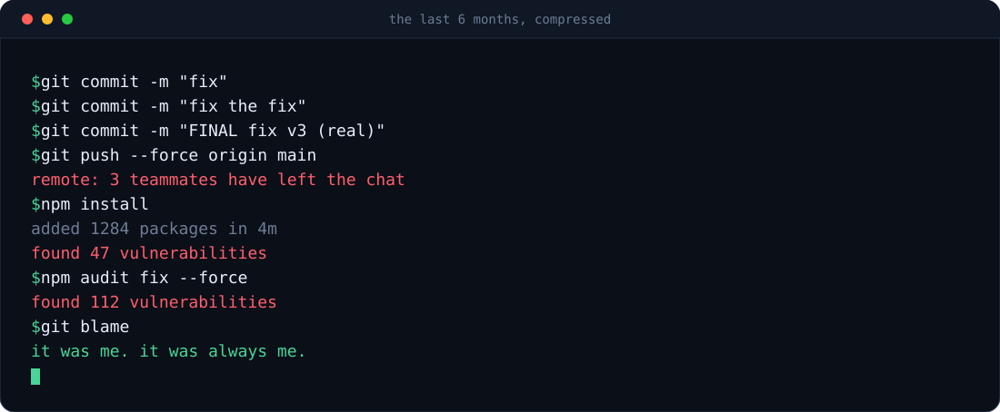

<div align="center">


</div>

## 💀 `whoami`

```js
const godd4mnit = {
  role:      "it worked yesterday",
  editor:    "whichever one is already open",
  os:        "the one that broke last",
  currently: "reading a stack trace I have read before",
  hobbies:   ["renaming variables", "reopening closed tickets"],
  fun_fact:  "I have never read a README. Including this one.",
}
```

<br/>

## 🔥 Current production status

<div align="center">
  
</div>

<br/>

## 📊 Skill tree

<div align="center">
  
</div>

<br/>

## 🖥️ `git log --oneline`

<div align="center">
  
</div>

<br/>

## 🧠 The evolution of a developer

```txt
🧠            if (isReady == true) { }
🧠✨          if (isReady === true) { }
🧠💡          if (isReady) { }
🧠🌌          if (!!isReady) { }
🌟🧠🌟        if (Boolean(isReady) === !!true) { } // peer reviewer has left the company
```

<br/>

## 🗿 Drake, but it's my workflow

<div align="center">

| 🙅 **Absolutely not** | 🙆 **Say less** |
|:---|:---|
| Writing unit tests | `console.log("here")` |
| Reading the official docs | A 2014 Stack Overflow answer with 3 upvotes |
| `git merge` and resolving conflicts | `git push --force` and a short prayer |
| Descriptive commit messages | `fix` |
| Refactoring the legacy module | `// TODO: refactor` (added 2019, still there) |
| Asking a senior dev | Asking an AI, then blaming the AI |

</div>

<br/>

## 📂 Click at your own risk

<details>
<summary><b>🔍 My debugging methodology</b></summary>

```js
console.log("1")
console.log("2")
console.log("HERE")
console.log("WHY")
console.log("WHYYYY")
console.log("😭")
// bug fixed. do not know which line did it. do not remove any of them.
```

</details>

<details>
<summary><b>🧪 My testing strategy</b></summary>

1. Open the app.
2. Click around a bit.
3. Looks fine.
4. Ship.
5. Get paged at 2am.
6. Return to step 1 with significantly more emotion.

</details>

<details>
<summary><b>🤝 How to collaborate with me</b></summary>

- Do **not** ask why it works.
- Do **not** ask why it stopped working.
- If you touch the config file, you own it now. That is the law.
- "It's a quick fix" is a threat, not an estimate.
- I will approve your PR in 4 seconds. I did not read it. LGTM 🚀

</details>

<details>
<summary><b>💼 Skills I actually have (seriously this time)</b></summary>

<br/>

Okay, jokes aside — the real stack:

`TypeScript` · `Node.js` · `NestJS` · `React` · `PostgreSQL` · `Redis` · `Docker` · `AWS` · `REST & WebSocket APIs`

Genuinely interested in backend architecture, developer tooling, and shipping things that don't wake me up at night.

</details>

<br/>

## 🐍 Watch a snake eat my commits

<div align="center">
  
</div>

<br/>

## 📈 Numbers that prove nothing

<div align="center">


<br/><br/>


</div>

<br/>

## 📜 The commandments

> **I.** Thou shalt not deploy on Friday. Unless it would be funny.
> **II.** `works on my machine` is legally binding.
> **III.** Every bug is a feature that has not been documented yet.
> **IV.** If the tests pass on the first try, be afraid.
> **V.** The build is green. Nobody knows why. Do not investigate.
> **VI.** `rm -rf node_modules` is a valid debugging step and a lifestyle.

<div align="center">
  
</div>
